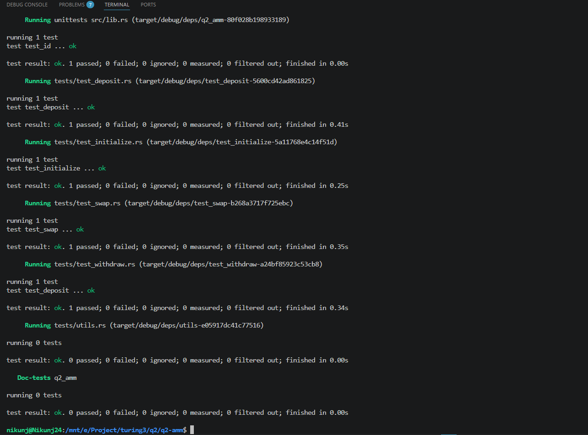

# Anchor AMM




---

## Clone Repository

```bash
git clone https://github.com/Nikuunj/q2-amm
cd q2-amm
```

---

# Installation

## Windows

Install WSL first.

Recommended:

* WSL2
* Ubuntu 22+

---

## macOS / Linux

Run:

```bash
curl --proto '=https' --tlsv1.2 -sSfL https://solana-install.solana.workers.dev | bash
```

After installation restart your terminal.

---

## Installed Versions Example

```bash
Rust: rustc 1.85.0 (4d91de4e4 2025-02-17)
Solana CLI: solana-cli 3.1.10
Anchor CLI: anchor-cli 1.0.2
Node.js: v23.9.0
Yarn: 1.22.1
```

---

# Project Structure

```bash
.
├── programs/
│   └── q2-amm/
├── tests/
├── migrations/
├── app/
├── Anchor.toml
└── README.md
```

---

# Build

Build the program:

```bash
anchor build
```

---

# Test

Run tests:

```bash
anchor test
```

Run tests without rebuilding:

```bash
anchor test --skip-build
```

## Run Single Test

```bash
anchor test -- --test test_swap
```

---

# AMM Architecture

The AMM uses the Constant Product Formula:

x . y = k

Where:

* `x` = token X reserve
* `y` = token Y reserve
* `k` = constant invariant

---

# Program Flow

## 1. Initialize

Creates:

* Config PDA
* LP mint
* Vault token accounts

### PDA Seeds

```rust
[b"config", seed.to_le_bytes()]
```

### Accounts Created

* Config account
* LP mint
* Vault X ATA
* Vault Y ATA

---

## 2. Deposit

Users deposit token X and token Y into the pool.

In return they receive LP tokens representing pool ownership.

### Flow

```text
User Tokens -> Vaults
Vaults -> Mint LP Tokens -> User
```

### Deposit Formula

LP shares are calculated proportionally based on current reserves.

---

## 3. Withdraw

Burn LP tokens to receive underlying assets.

### Flow

```text
Burn LP Tokens
Vault X -> User
Vault Y -> User
```

---

## 4. Swap

Swap token X for Y or token Y for X.

### Formula

(x + \Delta x)(y - \Delta y)=k

### Swap Process

```text
User deposits input token
AMM calculates output amount
Vault sends output token to user
```

### Slippage Protection

The `min` parameter protects users from receiving less than expected.

Example:

```rust
swap(is_x, amount, min)
```

If output amount is below `min`, transaction fails.

---

# Token Accounts

## Vault Accounts

Program owned token vaults:

* `vault_x`
* `vault_y`

These are Associated Token Accounts owned by the Config PDA.

---

## LP Mint

LP tokens are minted to liquidity providers.

Mint authority:

```text
Config PDA
```

---

# Fees

Swap fee is stored inside config:

```rust
pub fee: u16
```

Used during swap calculations.

---


---

# Common Errors

## Custom Error 6000

Usually happens because:

* swap output < minimum expected output
* invalid slippage limit
* zero amount passed

Example:

```rust
let min = 1;
```

instead of:

```rust
let min = amount_in;
```